# 🎉 Jimuqu Admin - 基于 Solon 的轻量级管理系统

### ✨ 介绍
**jimuqu-admin** 是基于 **Solon** 的轻量级管理系统框架。

> ❤️ 项目代码、文档均**开源免费可商用**，保留开源协议文件即可  
> 💡 活到老写到老 • 为兴趣而开源 • 为学习而开源 • 为技术共享而开源

🔗 前端项目地址：[https://gitee.com/chengliang4810/jimuqu-admin-ui](https://gitee.com/chengliang4810/jimuqu-admin-ui)  
📚 文档地址：[https://doc.jimuqu.com](https://doc.jimuqu.com)  
🌐 DeepWiki文档：[https://deepwiki.com/chengliang4810/jimuqu-admin](https://deepwiki.com/chengliang4810/jimuqu-admin)  
🚀 演示系统：[https://admin.jimuqu.com](https://admin.jimuqu.com)

---

## 🛠 主要技术栈

| 技术名                         | 作用                                      | 特点                                      |
|--------------------------------|------------------------------------------|------------------------------------------|
| **🚀 Solon**                   | Java 轻量级应用框架                      | 国产、高性能、低延时                     |
| **🧰 Hutool**                  | Java 工具库                              | 国产、简化代码、功能全面                 |
| **🔒 Sa-Token**                | 权限认证框架                             | 国产、轻量级、支持分布式会话             |
| **🗃️ Xbatis**                 | MyBatis 增强工具                         | 兼容 MyBatis、动态 SQL 支持              |
| **⚙️ AutoTable**              | 数据库表结构自动维护                     | 国产、支持多数据库                       |
| **📊 EasyExcel**               | Excel 导入导出工具                       | 阿里开源、避免 OOM                       |
| **👤 JustAuth**                | 第三方登录集成                           | 国产、支持 20+ 平台                      |
| **📍 ip2region**               | 离线 IP 地址定位                         | 数据本地化、毫秒级查询                   |
| **🔄 MapStruct Plus**          | 对象转换工具                             | 零反射、高性能                           |
| **🧩 Lombok**                  | 代码简化                                 | 减少样板代码                             |
| **💧 HikariCP**                | JDBC 连接池                              | 高性能、轻量级                           |
| **🧵 TransmittableThreadLocal**| 线程间上下文传递                         | 阿里开源、解决异步线程上下文丢失         |
| **💾 SQLite**                  | 嵌入式数据库                             | 轻量级、零配置、单文件存储               |
| **📝 Beetl/Velocity**          | 模板引擎                                 | Beetl国产高性能，Velocity老牌稳定       |

---

## 📋 功能列表

| 业务             | 功能说明                                                                 |
|------------------|--------------------------------------------------------------------------|
| **📱 客户端管理** | 管理对接客户端（PC/小程序等），支持动态授权登录方式和Token时效控制       |
| **👥 用户管理**   | 用户增删改查，分配部门/角色/岗位                                         |
| **🏢 部门管理**   | 树形组织结构管理（公司/部门/小组），支持数据权限                         |
| **📋 岗位管理**   | 配置用户职务信息                                                         |
| **📑 菜单管理**   | 配置系统菜单、操作权限、按钮权限标识                                     |
| **🔐 角色管理**   | 分配角色菜单权限，按机构划分数据范围                                     |
| **📖 字典管理**   | 维护系统固定数据（如状态/类型等）                                        |
| **⚙️ 参数管理**   | 动态配置系统参数                                                         |
| **📢 通知公告**   | 发布和维护系统公告                                                       |
| **📝 操作日志**   | 记录系统操作日志和异常信息                                               |
| **🔐 登录日志**   | 查询登录记录（含异常登录）                                               |
| **📂 文件管理**   | 文件展示/上传/下载/删除                                                  |
| **⚙️ 文件配置管理** | 动态管理文件上传/下载配置                                                |
| **👀 在线用户管理** | 监控在线用户并支持强制踢出                                               |
| **⏱️ 定时任务**   | 任务管理（增删改）、日志管理、执行器监控                                 |
| **💻 代码生成**   | 多数据源代码生成（Java/HTML/XML/SQL），支持CRUD下载                      |
| **🔌 系统接口**   | 自动生成API文档                                                          |

---

## 🖼 系统预览图

📸 **管理界面一览**  
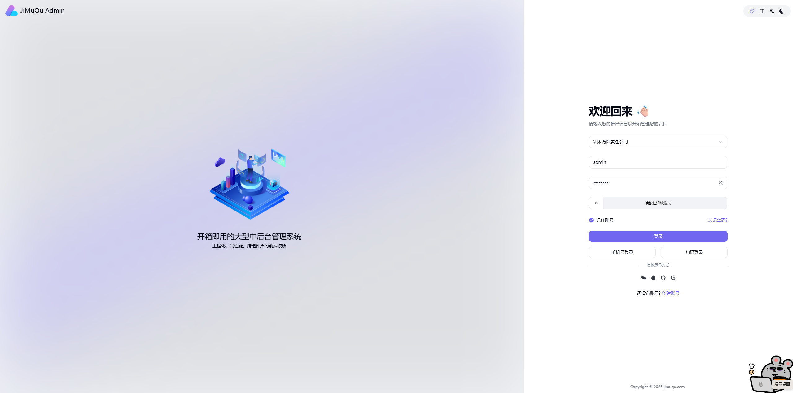
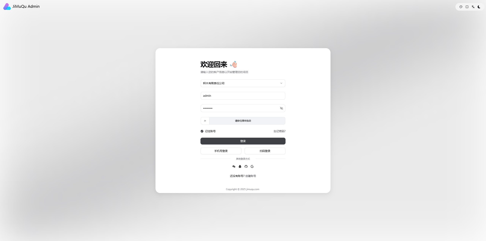
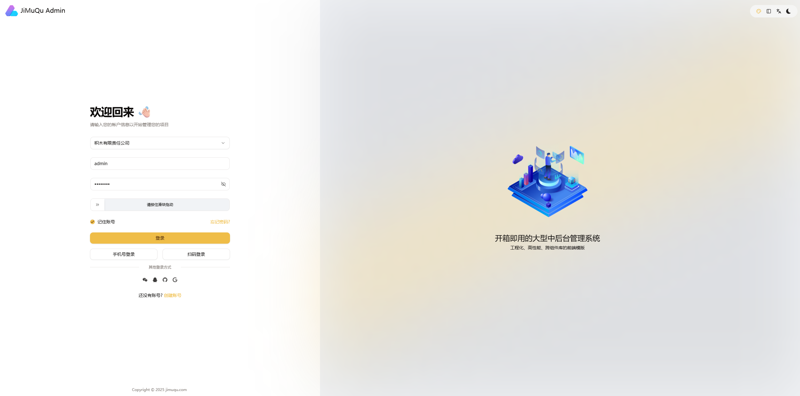
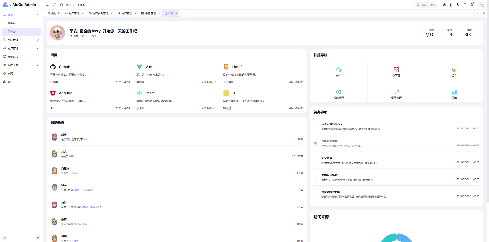
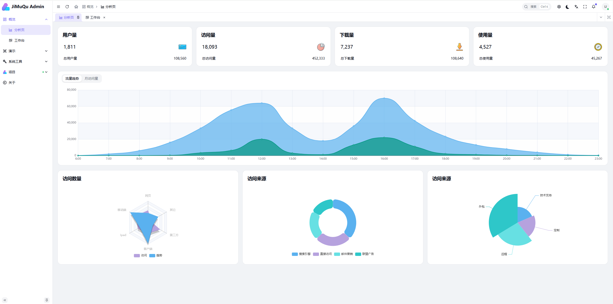  
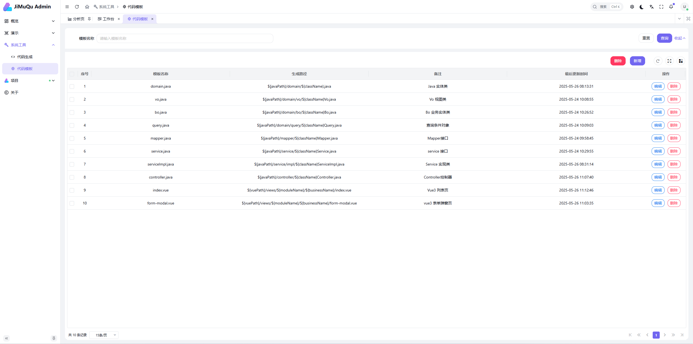  
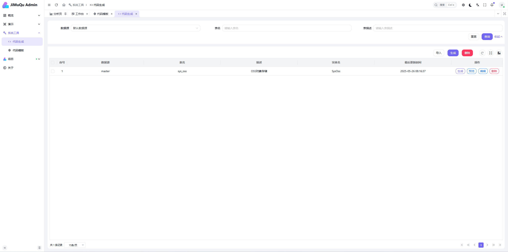  
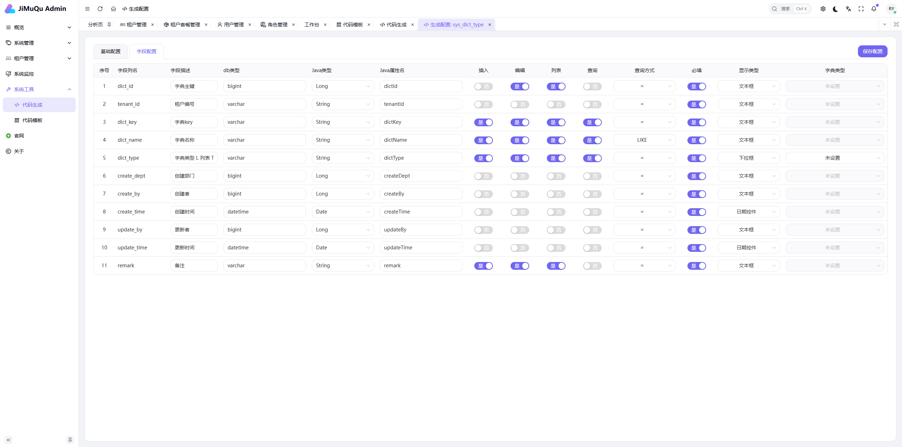
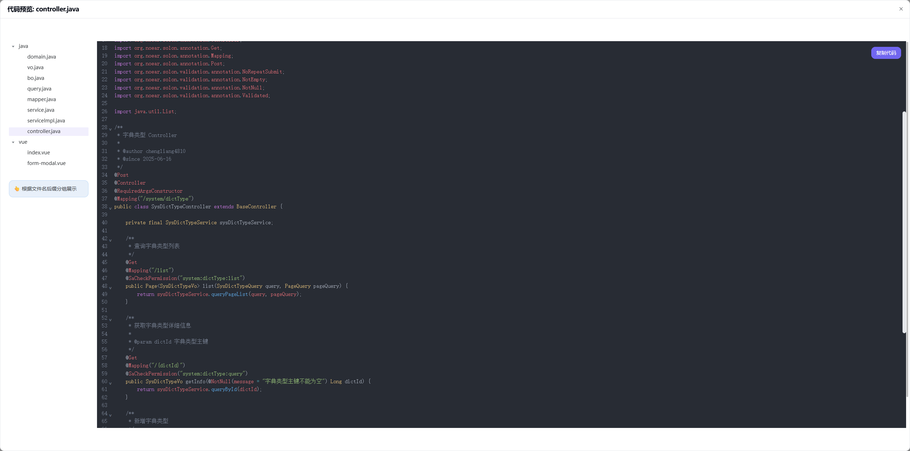
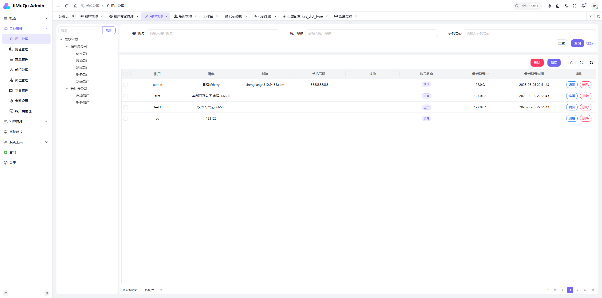
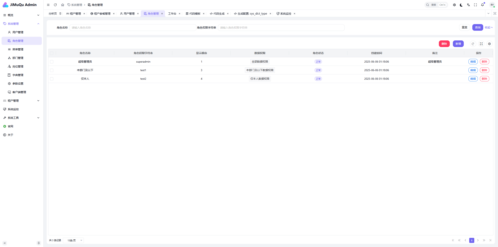
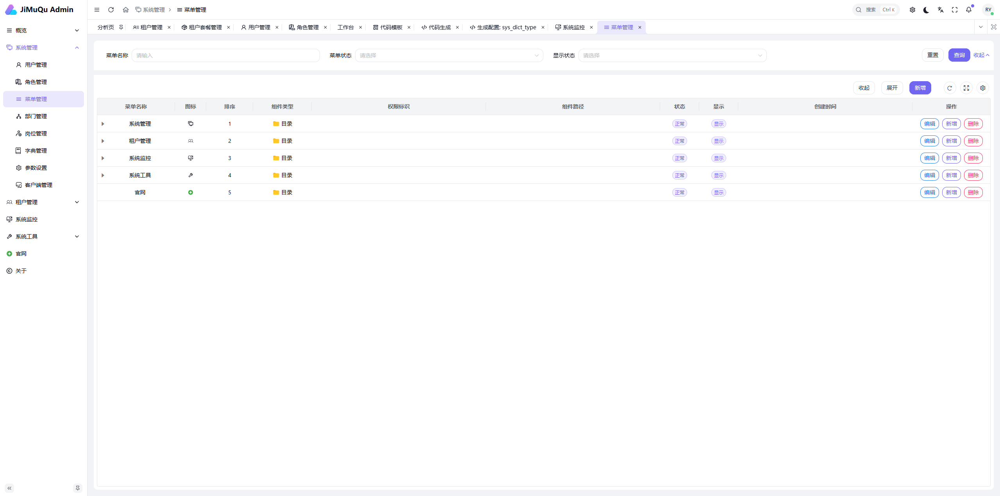
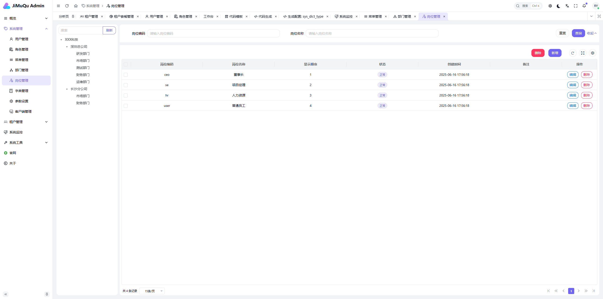
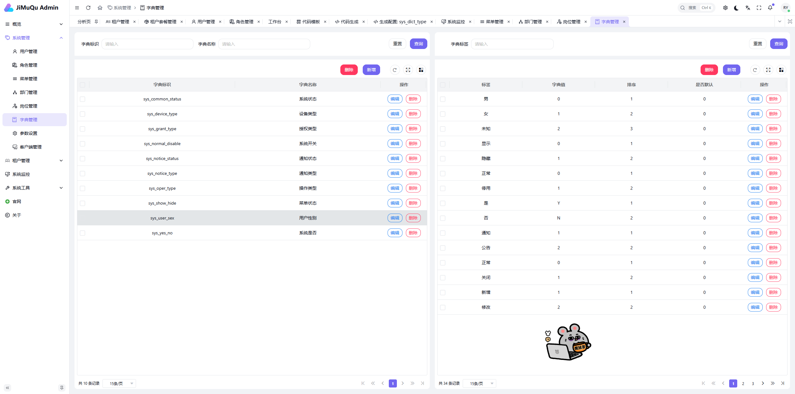
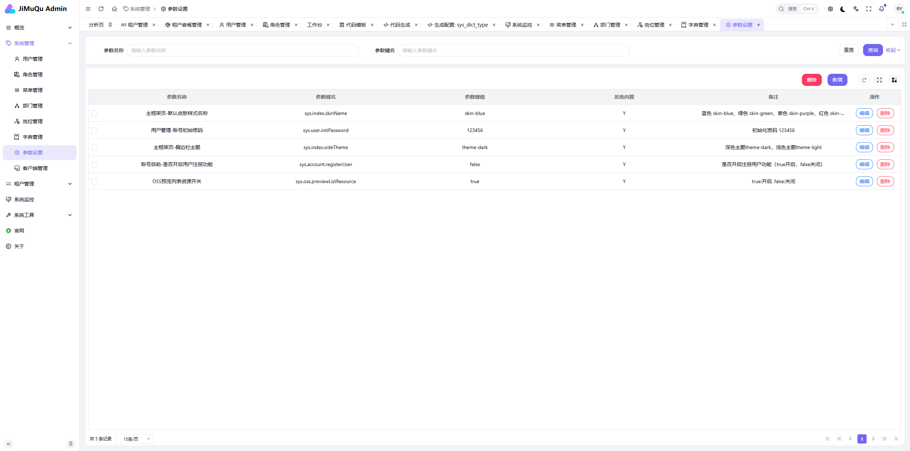
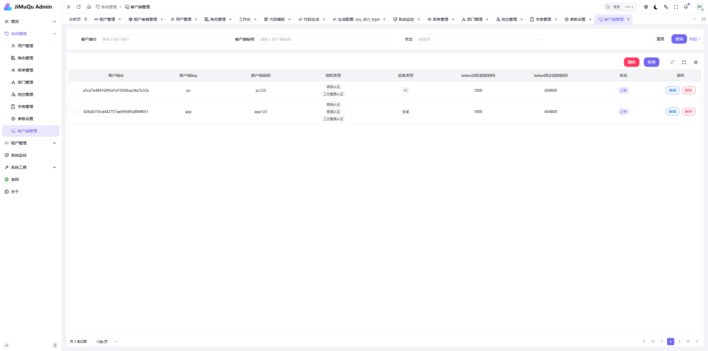

---

### 🌟 项目亮点
- **国产化技术栈**：Solon/Hutool/Sa-Token 等国产框架深度集成
- **轻量高效**：启动快、资源占用低、响应速度优异
- **开箱即用**：提供完整的管理系统基础功能模块
- **文档齐全**：中文文档 + 在线演示系统降低学习成本

**🎯 适合场景**：企业后台系统、快速开发平台、教学研究项目

---

### 交流群

> 请备注：加群、积木区、积木等字样

