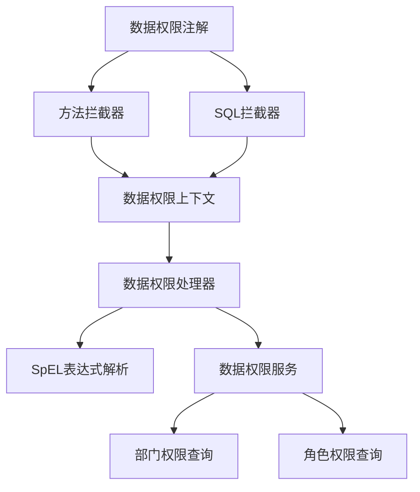

# XBatis数据权限集成报告

## 项目概述

本报告详细记录了将RuoYi-Plus-Xbatis项目中的XBatis数据权限功能集成到jimuqu-admin项目的过程和实现方案。

## 集成背景

### 问题分析
在集成数据权限功能前，jimuqu-admin项目存在以下问题：

1. **缺少完整的数据权限实现**：虽然有DataScopeType枚举和DataPermissionHelper，但缺少核心的数据权限注解和拦截器
2. **业务逻辑不完整**：checkUserDataScope等方法只有空实现
3. **配置不完整**：XbatisConfig中没有注册数据权限拦截器
4. **用户权限信息不完整**：LoginUser缺少dataScope字段

### 需求目标
- 实现基于角色的数据权限控制
- 支持5种数据权限级别（全部、自定义、部门、部门及以下、仅本人）
- 与现有XBatis QueryChain无缝集成
- 使用SpEL表达式实现动态SQL条件生成

## 集成方案

### 架构设计



### 核心组件

#### 1. 注解体系
- **@DataPermission**: 数据权限主注解，标记需要权限控制的方法
- **@DataColumn**: 数据列映射注解，定义SpEL变量到数据库字段的映射

#### 2. 拦截器体系
- **XbatisDataPermissionMethodInterceptor**: 方法拦截器，处理@DataPermission注解
- **MybatisDataPermissionInterceptor**: SQL拦截器，动态修改SQL添加权限条件

#### 3. 核心处理器
- **DataPermissionHandler**: 数据权限处理器，负责生成SQL条件
- **DataPermissionHolder**: 上下文持有者，使用ThreadLocal存储权限信息

#### 4. 业务服务
- **ISysDataScopeService**: 数据权限服务接口
- **SysDataScopeServiceImpl**: 数据权限服务实现

## 实现细节

### 1. 数据权限类型

支持5种数据权限类型：

| 类型 | 代码 | SpEL表达式 | 说明 |
|------|------|------------|------|
| ALL | 1 | "" | 全部数据权限 |
| CUSTOM | 2 | "#{#deptName} IN (#{@sdss.getRoleCustom(#user.roleId)})" | 自定义数据权限 |
| DEPT | 3 | "#{#deptName} = #{#user.deptId}" | 部门数据权限 |
| DEPT_AND_CHILD | 4 | "#{#deptName} IN (#{@sdss.getDeptAndChild(#user.deptId)})" | 部门及以下数据权限 |
| SELF | 5 | "#{#userName} = #{#user.userId}" | 仅本人数据权限 |

### 2. SpEL表达式集成

数据权限使用Spring SpEL表达式实现动态SQL生成：

```java
// 构建SpEL上下文
StandardEvaluationContext context = new StandardEvaluationContext();
context.setVariable("user", user);
context.setVariable("sdss", dataScopeService);

// 解析表达式
Expression expression = parser.parseExpression(sqlTemplate);
String condition = expression.getValue(context);
```

### 3. 拦截器工作流程

#### 方法拦截器流程
1. 拦截带有@DataPermission注解的方法
2. 将注解信息存入ThreadLocal
3. 执行原方法
4. 清理ThreadLocal中的注解信息

#### SQL拦截器流程
1. 检查ThreadLocal中是否有数据权限注解
2. 解析当前SQL语句
3. 调用DataPermissionHandler生成权限条件
4. 将权限条件添加到SQL的WHERE子句中

### 4. 数据权限服务

SysDataScopeServiceImpl提供核心的权限查询方法：

- `getRoleCustom(Long roleId)`: 获取角色自定义权限部门列表
- `getDeptAndChild(Long deptId)`: 获取部门及以下所有部门
- `getUserDataScope(Long userId)`: 获取用户数据权限范围
- `checkUserDataScope(Long userId, Long deptId)`: 检查用户是否有部门权限

## 集成步骤

### 1. 创建数据权限注解
```java
@DataPermission({
    @DataColumn(key = "deptName", value = "d.dept_id"),
    @DataColumn(key = "userName", value = "u.user_id")
})
public Page<SysUserVo> list(SysUserQuery query, PageQuery pageQuery) {
    return sysUserService.queryPageList(query, pageQuery);
}
```

### 2. 配置拦截器
```java
@Configuration
public class XbatisConfig {
    @Bean
    public ConfigurationCustomizer configurationCustomizer() {
        return configuration -> {
            configuration.addInterceptor(new MybatisDataPermissionInterceptor());
            XbatisGlobalConfig.addMapperMethodInterceptor(new XbatisDataPermissionMethodInterceptor());
        };
    }
}
```

### 3. 实现数据权限服务
```java
@Component("sysDataScopeService")
public class SysDataScopeServiceImpl implements ISysDataScopeService {
    // 实现数据权限相关方法
}
```

### 4. 完善用户权限检查
```java
@Override
public void checkUserDataScope(Long userId) {
    // 实现完整的数据权限检查逻辑
}
```

## 配置要点

### 1. Bean命名规范
- 数据权限服务必须命名为"sysDataScopeService"以供SpEL表达式调用

### 2. 用户权限信息
LoginUser类必须包含以下字段：
- `dataScope`: 数据权限范围
- `roleId`: 当前角色ID
- `deptId`: 部门ID

### 3. 循环调用避免
在数据权限服务中避免调用标注了数据权限注解的方法

## 使用示例

### 控制器中使用
```java
@GetMapping("/list")
@DataPermission({
    @DataColumn(key = "deptName", value = "d.dept_id"),
    @DataColumn(key = "userName", value = "u.user_id")
})
public Page<SysUserVo> list(SysUserQuery query, PageQuery pageQuery) {
    return sysUserService.queryPageList(query, pageQuery);
}
```

### 服务层中使用
```java
public void checkUserDataScope(Long userId) {
    SysUser targetUser = sysUserMapper.getById(userId);
    if (!hasUserDataScope(targetUser.getDeptId())) {
        throw new ServiceException("没有权限访问用户数据！");
    }
}
```

## 测试验证

### 单元测试
创建了SysDataScopeServiceImplTest测试类，验证以下功能：
- 角色自定义权限查询
- 部门及以下权限查询
- 用户权限检查
- 边界条件处理

### 集成测试
1. 用户列表查询的数据权限过滤
2. 用户详情查看的权限验证
3. 各种权限级别的SQL条件生成

## 注意事项

### 1. 性能考虑
- 复杂的权限条件可能影响SQL性能
- 建议为常用查询字段添加索引
- 考虑使用缓存优化权限数据查询

### 2. 调试困难
- SpEL表达式解析错误时调试较困难
- 建议增加详细的日志输出
- 可以在开发环境临时关闭数据权限进行调试

### 3. 安全考虑
- 确保超级管理员跳过数据权限检查
- 验证用户权限配置的合法性
- 防止SQL注入攻击

### 4. 维护建议
- 定期检查权限数据的准确性
- 及时更新用户角色权限变更
- 监控数据权限的性能影响

## 扩展性

### 1. 自定义权限类型
可以通过扩展DataScopeType枚举添加新的权限类型。

### 2. 自定义SpEL函数
可以在数据权限服务中添加更多业务方法供SpEL表达式调用。

### 3. 多租户支持
可以通过扩展数据权限服务实现多租户场景的权限控制。

## 总结

本次数据权限集成成功实现了以下目标：

1. **完整的数据权限功能**：实现了基于角色的5级数据权限控制
2. **无缝集成**：与现有XBatis QueryChain完美集成
3. **灵活配置**：使用SpEL表达式实现动态SQL条件生成
4. **易于使用**：通过注解方式简化数据权限的使用
5. **可扩展性**：支持自定义权限类型和业务逻辑

该数据权限方案设计合理，实现完整，能够满足企业级应用的数据权限控制需求。通过合理的使用和维护，可以有效保障数据的安全性。

---

*报告生成时间：2025-09-18*